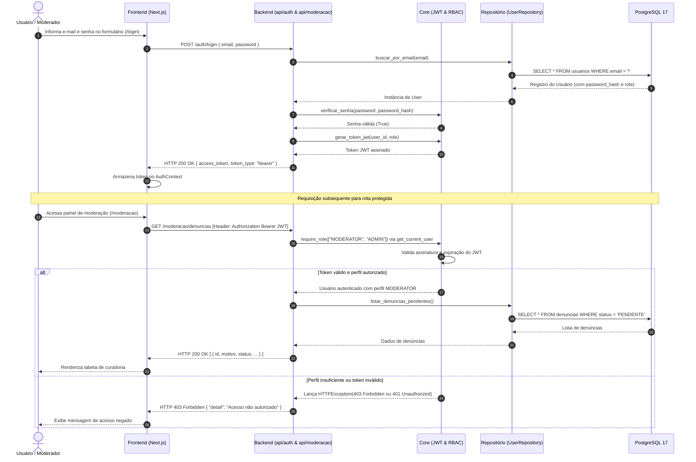
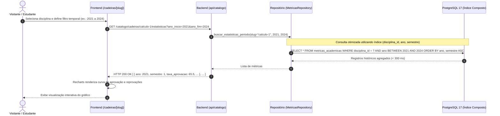
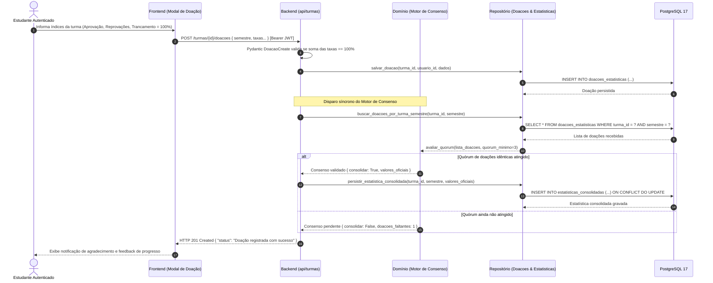
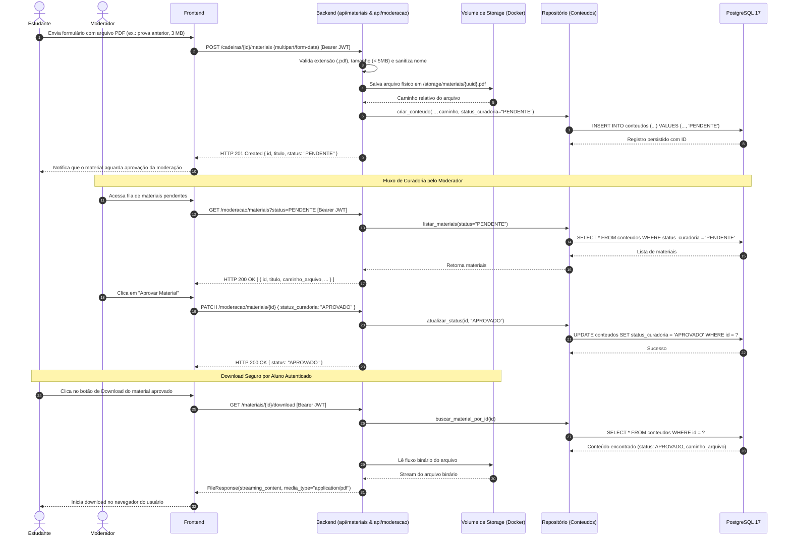
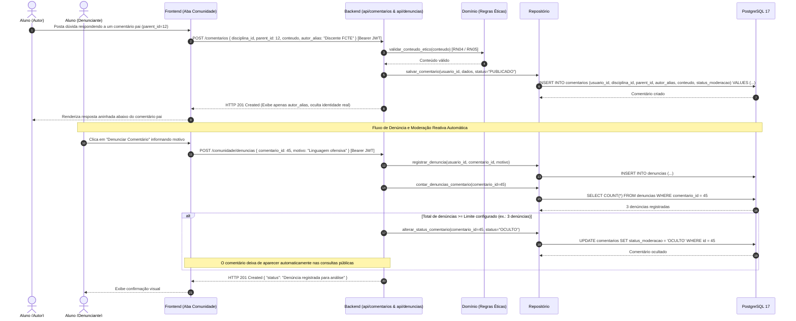
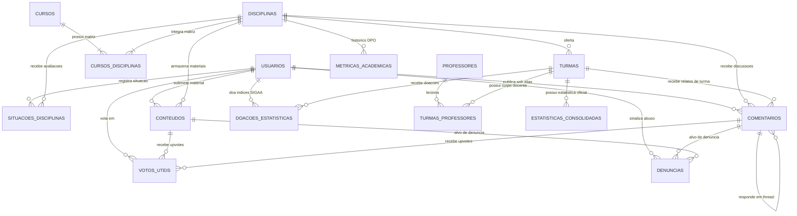

# 🏛️ Arquitetura de Software e Decisões Técnicas

Este documento descreve a especificação arquitetural do **Tamburetei UnB**, estabelecendo a estrutura macro e microarquitetural do sistema, a decomposição de componentes, as responsabilidades das camadas, os fluxos de comunicação integrados, a modelagem de dados e as Decisões de Arquitetura (ADRs).

O projeto é desenvolvido no escopo da disciplina Métodos de Desenvolvimento de Software (MDS 2026/2 — FCTE/UnB), sob a organização OpenDevUnB, priorizando simplicidade, alta testabilidade, conformidade com a LGPD (*Privacy by Design*) e reprodutibilidade integral em contêineres Docker.

---

## 1. Visão Geral e Macroarquitetura

O Tamburetei UnB é estruturado como um sistema web moderno de três camadas principais (**Frontend**, **Backend** e **Banco de Dados Relacional**), complementado por um **Volume de Armazenamento de Arquivos** e um **Pipeline de Ingestão de Dados Públicos (ETL)**.

```mermaid
graph TD
    subgraph Atores["Atores do Sistema"]
        V["Visitante (Sem login)"]
        E["Estudante (Autenticado)"]
        M["Moderador / Admin"]
    end

    subgraph FrontendApp["Frontend — Next.js 14+ (App Router)"]
        UI["Camada de Apresentação (React / Tailwind CSS)"]
        AuthCtx["AuthContext (Gestão de JWT / Sessão)"]
        Features["Módulos de Features (Cadeiras, Analytics, Colaboração)"]
        ApiClient["Cliente HTTP Tipado (Fetch API)"]
    end

    subgraph BackendApp["Backend — FastAPI (Clean Architecture)"]
        API["Camada de API (Routers HTTP & Pydantic v2)"]
        Core["Core (Segurança, JWT, Configurações)"]
        Services["Services (Orquestração de Casos de Uso)"]
        Domain["Domain (Regras de Negócio Puras & Cálculos)"]
        Repos["Repositories (SQLAlchemy 2.0 Assíncrono)"]
    end

    subgraph Armazenamento["Persistência e Arquivos"]
        DB[("PostgreSQL 17 (Docker)<br/>• Tabelas Canônicas<br/>• Views Materializadas<br/>• Índices B-Tree")]
        Storage[("Volume Docker Seguro<br/>• Arquivos Multipart<br/>• PDF, PNG, JPG")]
    end

    subgraph Pipeline["Ingestão de Dados Abertos"]
        ETL["Pipeline ETL Docker<br/>• DPO / INEP / LAI<br/>• Sanitização LGPD (RN07)"]
    end

    V -->|Navega / Consulta pública| UI
    E -->|Autentica / Vota / Comenta| UI
    M -->|Modera / Curadoria| UI

    UI --> AuthCtx
    UI --> Features
    Features --> ApiClient

    ApiClient -->|HTTP REST / JSON / Multipart| API
    API --> Core
    API --> Services
    Services --> Domain
    Services --> Repos
    Services -->|Gravação física de arquivos| Storage

    Repos -->|SQL assíncrono (asyncpg)| DB
    ETL -->|Carga de métricas históricas| DB
```

### Princípios Norteadores da Arquitetura:
1. **Clean Architecture e Baixo Acoplamento:** As regras de negócio essenciais residem no domínio puro (`domain/`), desprovidas de qualquer dependência de frameworks web, drivers de banco ou bibliotecas de I/O.
2. **Anti-Sobre-Engenharia (*Keep It Simple*):** Rejeição explícita de componentes que elevem a complexidade de infraestrutura e CI/CD sem ganho proporcional, como caches externos (Redis), filas complexas (RabbitMQ/Celery) ou bancos NoSQL (ADR 01).
3. **Privacidade por Padrão (*Privacy by Design*):** Conformidade rigorosa com a LGPD, garantindo que nenhum dado institucional sensível (matrícula, CPF, IRA) seja coletado, armazenado ou inferido.
4. **Database-as-Code:** Nenhuma intervenção estrutural direta no banco de dados; toda alteração de esquema é versionada através de migrações automáticas do Alembic (ADR 02).

---

## 2. Decomposição de Componentes e Responsabilidades

### 2.1. Frontend — Next.js (App Router)

O frontend é construído com **Next.js (App Router)**, **React**, **TypeScript** e estilizado com **Tailwind CSS**. Sua estrutura modular organiza as responsabilidades de forma coesa:

```
frontend/src/
├── app/                  # Roteamento baseado em arquivos (App Router)
│   ├── layout.tsx        # Shell global, Navbar, Footer e Provedor de Tema
│   ├── page.tsx          # Página inicial: métricas agregadas da UnB e busca central
│   ├── login/            # Tela de login e autenticação
│   ├── cadastro/         # Tela de registro simples (Nome, E-mail, Senha)
│   ├── cadeiras/         # Catálogo curricular, seletor de cursos e busca
│   │   └── [slug]/       # Hub modular da matéria (abas temáticas e gráficos)
│   └── moderacao/        # Painel administrativo protegido para curadoria
├── features/             # Módulos funcionais encapsulados
│   ├── analytics/        # Componentes de gráficos (Recharts) e filtros temporais
│   ├── cadeiras/         # Cards de disciplinas, matriz curricular e badges
│   ├── colaboracao/      # Registro "Já cursei", upload de materiais e upvotes
│   └── comentarios/      # Seção de relatos anônimos e árvore de threads
├── components/ui/        # Design system atômico e componentes reutilizáveis
└── services/             # Clientes HTTP tipados com tratamento de erros
```

#### Responsabilidades dos Componentes de Frontend:
* **Camada de Apresentação e Páginas (`app/`):** Renderiza a interface adaptativa e acessível. Utiliza Server Components para SEO e carregamento veloz, e Client Components (`'use client'`) para interações ricas, como formulários e alternância de abas.
* **Gestão de Sessão (`AuthContext`):** Armazena de forma segura o token JWT em memória/cookies HttpOnly, gerencia o estado global de autenticação, decodifica o perfil do usuário (`STUDENT`, `MODERATOR`, `ADMIN`) e injeta o cabeçalho `Authorization: Bearer <token>` nas requisições protegidas.
* **Módulos de Features (`features/`):** Encapsulam as regras de interface, como filtros com *debounce* na busca de disciplinas, montagem dinâmica dos gráficos temporais e renderização de respostas aninhadas (*threads*).
* **Camada de Integração (`services/`):** Abstrai as chamadas HTTP para o backend FastAPI, implementando tratamento uniforme de respostas, estados de carregamento (*loading skeletons*) e mensagens semânticas de erro (ex.: 401 para redirecionamento ao login, 403 para permissão negada).

---

### 2.2. Backend — FastAPI (Clean Architecture)

O backend é desenvolvido em **Python 3.12+** utilizando o framework assíncrono **FastAPI** e validação estrita com **Pydantic v2**, organizado em camadas bem delimitadas:

```
backend/app/
├── api/             # Routers HTTP do FastAPI e Schemas Pydantic (entrada/saída)
├── core/            # Configurações de ambiente (.env), segurança e tokens JWT
├── domain/          # Lógica de negócio pura (cálculos, quórum, moderação)
├── services/        # Casos de uso e orquestração entre API e repositórios
├── repositories/    # Consultas SQL e persistência assíncrona via SQLAlchemy
├── models/          # Entidades relacionais declarativas mapeadas no PostgreSQL 17
└── pipeline/        # Ingestão ETL: extração DPO/INEP, normalização e carga
```

#### Responsabilidades de Cada Camada:

| Camada | Responsabilidades Principais | O que é PROIBIDO fazer |
| :--- | :--- | :--- |
| **`api/`** | - Definir rotas HTTP e verbos REST.<br>- Validar entradas e serializar saídas via Schemas Pydantic v2.<br>- Retornar status codes HTTP adequados (200, 201, 400, 403, 404, 413, 415, 422). | Executar consultas diretas ao banco de dados ou implementar regras de cálculo complexas. |
| **`core/`** | - Carregar configurações de ambiente (`.env`).<br>- Gerenciar ciclo de vida do JWT (emissão, decodificação, expiração).<br>- Prover dependências RBAC (`get_current_user`, `require_role`).<br>- Criptografia de senhas com algoritmo bcrypt. | Conter lógica específica de funcionalidades de disciplinas ou comentários. |
| **`domain/`** | - Cálculo da taxa de evasão institucional ($RN08$).<br>- Cálculo de taxas de aprovação, reprovação e trancamento.<br>- Motor de consenso e regras de quórum para doações colaborativas.<br>- Lógica de determinação de badges de dificuldade.<br>- Validações de conduta ética ($RN04, RN05$). | Importar módulos de banco de dados (`SQLAlchemy`), bibliotecas de rede ou dependências de frameworks web (`FastAPI`). |
| **`services/`** | - Orquestrar casos de uso e transações de negócio.<br>- Integrar chamadas entre repositórios e regras de domínio.<br>- Gerenciar o armazenamento físico de arquivos multipart recebidos.<br>- Acionar regras de moderação reativa quando conteúdos atingem limite de denúncias. | Conter detalhes de sintaxe SQL ou renderização de respostas HTTP diretas. |
| **`repositories/`** | - Executar consultas SQL assíncronas utilizando SQLAlchemy 2.0.<br>- Aplicar estratégias de carregamento (`selectinload` / `joinedload`) para prevenir *queries N+1*.<br>- Consultar e gerenciar a atualização de Views Materializadas.<br>- Garantir que as buscas indexadas respondam em menos de 300 ms. | Aplicar regras de validação de negócios que não sejam restrições de integridade relacional. |
| **`models/`** | - Mapear entidades do banco de dados no PostgreSQL 17.<br>- Definir chaves primárias (UUID / SERIAL), tipos de dados, chaves estrangeiras e índices.<br>- Declarar constraints de integridade (`CHECK`, `UNIQUE`, `ON DELETE CASCADE/SET NULL`). | Conter métodos com regras de negócio ou chamadas de I/O. |
| **`pipeline/`** | - Executar rotinas ETL de ingestão dos dados abertos (DPO, INEP, LAI).<br>- Normalizar dados históricos e aplicar a política de baixa amostragem ($RN07$: consolidar turmas com $< 5$ alunos). | Inserir dados sem passar pela validação de integridade do esquema. |

---

### 2.3. Banco de Dados — PostgreSQL 17

O **PostgreSQL 17**, executado em contêiner Docker oficial, atua como o único repositório de persistência estruturada do sistema:
* **Transações ACID:** Garante consistência rigorosa em operações de doação, contagem de votos e integridade relacional.
* **Tipagem Avançada e Desempenho:** Utiliza tipos nativos `UUID` para usuários, campos de texto otimizados com compressão `TOAST` para ementas longas e índices `B-Tree` em colunas de alta seletividade (ex.: `slug`, `codigo`, `email`).
* **Views Materializadas:** Empregadas para consolidar agregações computacionalmente densas (como evasão por campus e métricas institucionais) sem introduzir Redis ou camadas extras de cache na infraestrutura (ADR 01).
* **Database-as-Code:** Toda a criação e evolução de tabelas, índices e restrições é estritamente gerenciada pelo **Alembic**, sendo vedada a execução manual de comandos DDL (ADR 02).

---

### 2.4. Sistema de Armazenamento de Arquivos (Storage Local em Volume)

Para atender ao compartilhamento colaborativo de materiais acadêmicos (PDFs de provas antigas, resumos e imagens conceituais):
* Os arquivos enviados via requisições `multipart/form-data` são validados quanto ao tipo MIME (PDF, PNG, JPG) e tamanho máximo (5 MB).
* O binário é gravado em um volume Docker dedicado (`storage_data`), enquanto o banco de dados armazena apenas o caminho relativo, metadados e estado de curadoria.
* O download é protegido pelo backend e servido de forma controlada através de streaming com `FileResponse`, assegurando que materiais não autorizados ou sob moderação não fiquem expostos publicamente.

---

## 3. Comunicação entre Frontend, Backend e Banco de Dados

### 3.1. Padrões de Comunicação e Contratos de Interface

* **Protocolo de Aplicação:** HTTPS com arquitetura RESTful stateless sobre JSON (`application/json`).
* **Submissão de Binários:** Requisições `multipart/form-data` para envio simultâneo de arquivos e metadados.
* **Autenticação e Sessão:** O cliente web inclui o token JWT no cabeçalho `Authorization: Bearer <token>` para acessar rotas protegidas. O backend valida a assinatura, expiração e perfil do usuário a cada requisição via dependência de injeção FastAPI (`get_current_user` / `require_role`).
* **Persistência Assíncrona:** A comunicação entre o backend FastAPI e o PostgreSQL 17 utiliza o driver assíncrono de alta performance `asyncpg` intermediado pelo SQLAlchemy 2.0 em pool de conexões reutilizáveis.

---

### 3.2. Fluxos e Diagramas de Sequência Arquiteturais

#### Fluxo 1: Autenticação Stateless (JWT) e Controle de Acesso Baseado em Perfis (RBAC)

Demonstra o login do usuário, retorno do token e posterior validação de permissão para um endpoint restrito a moderadores.



---

#### Fluxo 2: Navegação Curricular e Séries Históricas Analíticas (< 300 ms)

Ilustra a consulta de uma disciplina por slug e o carregamento ágil das taxas históricas por intervalo temporal.



---

#### Fluxo 3: Doação Colaborativa Discente e Motor de Consenso (Quórum)

Demonstra a doação de índices extraídos do SIGAA por um estudante e o processamento automático do quórum de consenso para consolidação dos dados.



---

#### Fluxo 4: Submissão Multipart, Moderação e Download Seguro de Materiais

Apresenta o ciclo de vida completo de um material de estudo: envio, validação física, curadoria do moderador e disponibilização de download autenticado.



---

#### Fluxo 5: Relatos Comunitários sob Pseudônimo (*Alias*), Threads Aninhadas e Denúncias

Ilustra a publicação de comentários em árvore respeitando a regra de anonimato ($RN01$), com gatilho de moderação reativa por denúncias.



---

## 4. Diagrama Entidade-Relacionamento e Modelagem Relacional

### 4.1. Diagrama Entidade-Relacionamento Consolidado (DER)

Abaixo é apresentado o modelo relacional consolidado integrando o núcleo curricular, as métricas históricas oficiais, as interações de crowdsourcing discente e as entidades de apoio às turmas, doações e denúncias:



---

### 4.2. Especificação Canônica das Tabelas (PostgreSQL 17)

#### Gestão de Acesso e Governança
* **`usuarios`**:
  * `id` (`UUID`, PK, default `gen_random_uuid()`): Identificador anônimo único.
  * `nome` (`VARCHAR(100)`): Nome informado no cadastro.
  * `email` (`VARCHAR(150)`, UNIQUE): E-mail de login com índice `ix_usuarios_email`.
  * `password_hash` (`VARCHAR(255)`): Senha criptografada com hash forte bcrypt.
  * `role` (`VARCHAR(20)`): Papel no sistema (`STUDENT`, `MODERATOR`, `ADMIN`).
  * `is_active` (`BOOLEAN`, default `TRUE`): Controle de conta ativa.
  * `created_at` (`TIMESTAMPTZ`, default `NOW()`): Carimbo de criação.
  * *Observação:* Não contém colunas para matrícula, CPF ou IRA discente (*Privacy by Design*).

#### Estrutura Curricular e Departamental
* **`cursos`**: `id` (`SERIAL`, PK), `codigo_mec` (`VARCHAR(20)`, UNIQUE), `nome` (`VARCHAR(150)`), `campus` (`VARCHAR(100)`), `grau` (`VARCHAR(50)`), `turno` (`VARCHAR(50)`), `slug` (`VARCHAR(150)`, UNIQUE).
* **`disciplinas`**: `id` (`SERIAL`, PK), `codigo` (`VARCHAR(30)`), `slug` (`VARCHAR(150)`, UNIQUE), `nome` (`VARCHAR(150)`), `departamento` (`VARCHAR(100)`), `creditos` (`INT`), `carga_horaria` (`INT`), `ementa` (`TEXT` comprimido via TOAST), `badge_aprovacao` (`VARCHAR(20)` nullable).
* **`cursos_disciplinas`**: `id` (`SERIAL`, PK), `curso_id` (`INT`, FK $\rightarrow$ `cursos.id` ON DELETE CASCADE), `disciplina_id` (`INT`, FK $\rightarrow$ `disciplinas.id` ON DELETE CASCADE), `periodo_sugerido` (`INT` nullable), `is_obrigatoria` (`BOOLEAN`). Constraint: `UNIQUE(curso_id, disciplina_id)`.
* **`professores`**: `id` (`SERIAL`, PK), `nome` (`VARCHAR(150)`), `departamento` (`VARCHAR(100)`), `created_at` (`TIMESTAMPTZ`).
* **`turmas`**: `id` (`SERIAL`, PK), `disciplina_id` (`INT`, FK $\rightarrow$ `disciplinas.id` ON DELETE CASCADE), `codigo_turma` (`VARCHAR(10)`), `semestre` (`VARCHAR(10)`), `created_at` (`TIMESTAMPTZ`).
* **`turmas_professores`**: `turma_id` (`INT`, FK $\rightarrow$ `turmas.id` ON DELETE CASCADE), `professor_id` (`INT`, FK $\rightarrow$ `professores.id` ON DELETE CASCADE), PK composta `(turma_id, professor_id)`.

#### Séries Históricas e Métricas Oficiais
* **`metricas_academicas`**:
  * `id` (`BIGSERIAL`, PK), `disciplina_id` (`INT`, FK $\rightarrow$ `disciplinas.id` ON DELETE CASCADE), `ano` (`INT`), `semestre` (`INT`, CHECK `semestre IN (1, 2)`), `matriculados` (`INT`), `aprovados` (`INT`), `reprovados_nota` (`INT`), `reprovados_falta` (`INT`), `trancamentos` (`INT`), `taxa_aprovacao` (`NUMERIC(5,2)`).
  * *Constraint:* `UNIQUE(disciplina_id, ano, semestre)`.
  * *Índice:* Composto `(disciplina_id, ano, semestre)` para respostas analíticas em $< 300\text{ ms}$.

#### Doações Colaborativas e Motor de Consenso
* **`doacoes_estatisticas`**: `id` (`BIGSERIAL`, PK), `turma_id` (`INT`, FK $\rightarrow$ `turmas.id` ON DELETE CASCADE), `usuario_id` (`UUID`, FK $\rightarrow$ `usuarios.id` ON DELETE CASCADE), `semestre_referencia` (`VARCHAR(10)`), `taxa_aprovacao` (`NUMERIC(5,2)`), `taxa_reprovacao_nota` (`NUMERIC(5,2)`), `taxa_reprovacao_falta` (`NUMERIC(5,2)`), `taxa_trancamento` (`NUMERIC(5,2)`), `created_at` (`TIMESTAMPTZ`). Constraint: `UNIQUE(turma_id, usuario_id, semestre_referencia)`.
* **`estatisticas_consolidadas`**: `id` (`BIGSERIAL`, PK), `turma_id` (`INT`, FK $\rightarrow$ `turmas.id` ON DELETE CASCADE), `semestre_referencia` (`VARCHAR(10)`), `taxa_aprovacao` (`NUMERIC(5,2)`), `taxa_reprovacao_nota` (`NUMERIC(5,2)`), `taxa_reprovacao_falta` (`NUMERIC(5,2)`), `taxa_trancamento` (`NUMERIC(5,2)`), `status` (`VARCHAR(20)` default `'VALIDADO'`), `updated_at` (`TIMESTAMPTZ`). Constraint: `UNIQUE(turma_id, semestre_referencia)`.

#### Crowdsourcing e Interações da Comunidade
* **`situacoes_disciplinas`**: `id` (`BIGSERIAL`, PK), `usuario_id` (`UUID`, FK $\rightarrow$ `usuarios.id` ON DELETE CASCADE), `disciplina_id` (`INT`, FK $\rightarrow$ `disciplinas.id` ON DELETE CASCADE), `situacao` (`VARCHAR(20)`, CHECK `situacao IN ('APROVADO', 'REPROVADO_NOTA', 'REPROVADO_FALTA', 'TRANCOU')`), `updated_at` (`TIMESTAMPTZ`). Constraint: `UNIQUE(usuario_id, disciplina_id)` ($RN02$).
* **`conteudos`**: `id` (`BIGSERIAL`, PK), `disciplina_id` (`INT`, FK $\rightarrow$ `disciplinas.id` ON DELETE CASCADE), `usuario_id` (`UUID`, FK $\rightarrow$ `usuarios.id` ON DELETE SET NULL), `titulo` (`VARCHAR(200)`), `descricao` (`TEXT`), `tipo` (`VARCHAR(30)`, CHECK `tipo IN ('LINK_UTIL', 'RESUMO', 'PROVA_ANTIGA', 'DICA')`), `url_origem` (`TEXT` nullable), `caminho_arquivo` (`TEXT` nullable), `formato` (`VARCHAR(30)` nullable), `semestre` (`VARCHAR(10)`), `status_curadoria` (`VARCHAR(20)`, default `'PENDENTE'`, CHECK `status_curadoria IN ('PENDENTE', 'APROVADO', 'RECUSADO')`), `created_at` (`TIMESTAMPTZ`).
* **`comentarios`**: `id` (`BIGSERIAL`, PK), `disciplina_id` (`INT` nullable, FK $\rightarrow$ `disciplinas.id` ON DELETE CASCADE), `turma_id` (`INT` nullable, FK $\rightarrow$ `turmas.id` ON DELETE CASCADE), `usuario_id` (`UUID`, FK $\rightarrow$ `usuarios.id` ON DELETE SET NULL), `autor_alias` (`VARCHAR(50)`, default `'Estudante Anônimo'`), `topico_dificuldade` (`VARCHAR(150)`), `conteudo` (`TEXT`), `parent_id` (`BIGINT` nullable, FK $\rightarrow$ `comentarios.id` ON DELETE CASCADE), `status_moderacao` (`VARCHAR(20)`, default `'PUBLICADO'`, CHECK `status_moderacao IN ('PUBLICADO', 'PENDENTE', 'OCULTO')`), `created_at` (`TIMESTAMPTZ`). Constraint CHECK: `(disciplina_id IS NOT NULL AND turma_id IS NULL) OR (disciplina_id IS NULL AND turma_id IS NOT NULL)`.
* **`votos_uteis`**: `id` (`BIGSERIAL`, PK), `usuario_id` (`UUID`, FK $\rightarrow$ `usuarios.id` ON DELETE CASCADE), `target_type` (`VARCHAR(20)`, CHECK `target_type IN ('CONTEUDO', 'COMENTARIO')`), `target_id` (`BIGINT`), `created_at` (`TIMESTAMPTZ`). Constraint: `UNIQUE(usuario_id, target_type, target_id)` ($RN03$).
* **`denuncias`**: `id` (`BIGSERIAL`, PK), `usuario_id` (`UUID`, FK $\rightarrow$ `usuarios.id` ON DELETE CASCADE), `comentario_id` (`BIGINT` nullable, FK $\rightarrow$ `comentarios.id` ON DELETE CASCADE), `material_id` (`BIGINT` nullable, FK $\rightarrow$ `conteudos.id` ON DELETE CASCADE), `motivo` (`TEXT`), `status` (`VARCHAR(20)`, default `'PENDENTE'`), `created_at` (`TIMESTAMPTZ`). Constraint CHECK: `(comentario_id IS NOT NULL AND material_id IS NULL) OR (comentario_id IS NULL AND material_id IS NOT NULL)`.

---

## 5. Matriz de Rastreabilidade Arquitetural (Histórias de Usuário $\leftrightarrow$ Componentes)

Esta matriz demonstra o mapeamento explícito entre as histórias de usuário priorizadas e os componentes arquiteturais responsáveis por atendê-las:

| Épico de Negócio | Histórias de Usuário Relacionadas | Componentes Frontend (Next.js) | Componentes Backend (FastAPI) | Componentes Database (PostgreSQL 17) |
| :--- | :--- | :--- | :--- | :--- |
| **Épico 1: Autenticação e Segurança** | - Backend: US 1.1.1, 1.1.2, 1.1.3, 1.2.1<br>- Frontend: US 1.1.1, 1.1.2<br>- Database: US 1.1.1 | `/cadastro`, `/login`, `AuthContext` | `api/auth.py`, `core/security.py`, `core/jwt.py`, `services/auth_service.py` | Tabela `usuarios`, índice único `ix_usuarios_email` |
| **Épico 2: Gestão Curricular e Catálogo** | - Backend: US 2.1.1, 2.2.1, 4.1.1, 4.1.2, 4.2.1, 6.1.1<br>- Frontend: US 2.1.1, 2.1.2, 3.1.1<br>- Database: US 2.1.1, 2.1.2 | `/cadeiras`, `/cadeiras/[slug]`, cards de matérias, barra de busca com *debounce* | `api/catalogo.py`, `services/catalogo_service.py`, `domain/badge_service.py`, `repositories/disciplinas_repo.py` | Tabelas `cursos`, `disciplinas`, `cursos_disciplinas`, `professores`, `turmas`, índices em `slug` e `codigo` |
| **Épico 3: Séries Históricas e Doações SIGAA** | - Backend: US 3.1.1, 3.2.1, 3.2.2, 3.3.1<br>- Frontend: US 3.1.2, 4.1.1<br>- Database: US 3.1.1, 4.1.1 | Aba de estatísticas em `/cadeiras/[slug]`, gráficos com Recharts, filtros temporais | `api/turmas.py`, `domain/quorum_consensus.py`, `services/doacoes_service.py`, `repositories/metricas_repo.py` | Tabelas `metricas_academicas`, `doacoes_estatisticas`, `estatisticas_consolidadas`, índice composto `(disciplina_id, ano)` |
| **Épico 4: Crowdsourcing ("Já cursei")** | - Backend: RF06, RN02<br>- Frontend: US 4.1.1<br>- Database: US 4.1.1 | Componente de votação no topo de `/cadeiras/[slug]` | `api/crowdsourcing.py`, `services/situacoes_service.py`, `repositories/situacoes_repo.py` | Tabela `situacoes_disciplinas` com constraint `UNIQUE(usuario_id, disciplina_id)` |
| **Épico 5: Conteúdos, Upvotes e Curadoria** | - Backend: US 5.2.1, 5.2.2, 5.2.3, 5.3.2<br>- Frontend: US 4.2.1, 4.2.2, 5.2.1<br>- Database: US 5.1.1, 5.1.3 | Abas de resumos/provas, botão de upvote, modal multipart, `/moderacao` | `api/materiais.py`, `api/moderacao.py`, `services/storage_service.py`, `FileResponse` | Tabelas `conteudos`, `votos_uteis`, volume Docker `/storage_data` |
| **Épico 6: Comunidade, Threads e Moderação** | - Backend: US 5.1.1, 5.1.2, 5.1.3, 5.3.1, 5.3.2<br>- Frontend: US 5.1.1<br>- Database: US 5.1.2 | Aba *Dificuldades & Dicas*, seção de comentários aninhados sob *alias* | `api/comentarios.py`, `domain/moderacao.py`, `repositories/comentarios_repo.py` | Tabelas `comentarios` (auto-relacionamento `parent_id`) e `denuncias` |
| **Épico 7: Dashboard Institucional e Evasão** | - Backend: US 6.2.1, 6.2.2, 6.2.3<br>- Frontend: US 6.1.1<br>- Database: RN08 | Página inicial (`/`), cards de indicadores globais, download CSV/JSON | `api/dashboard.py`, `domain/evasao.py`, `repositories/dashboard_repo.py` | View Materializada `vm_evasao_campus`, agregação `MetricaCurso` |

---

## 6. Decisões Arquiteturais Registradas (ADRs)

### ADR 01: Rejeição de Redis e Bancos NoSQL
* **Status:** Aprovado / Ativo.
* **Contexto:** A plataforma exige respostas analíticas com tempo de resposta $< 300\text{ ms}$ e alta confiabilidade, sem onerar a complexidade de configuração dos desenvolvedores nem pipelines de CI/CD.
* **Decisão:** Não utilizar Redis, MongoDB nem filas complexas (RabbitMQ/Celery).
* **Justificativa:** O PostgreSQL 17 atende com extrema folga aos requisitos de latência através de índices adequados `B-Tree` e Views Materializadas para consultas pesadas de evasão e fluxo curricular. Evita sobre-engenharia (*over-engineering*).

### ADR 02: Database-as-Code com Alembic
* **Status:** Aprovado / Ativo.
* **Contexto:** Garantir a reprodutibilidade integral do esquema relacional entre os membros do time e nos ambientes automatizados de teste e produção.
* **Decisão:** Toda e qualquer evolução do esquema do banco de dados deve ser executada exclusivamente por migrações versionadas do Alembic (`alembic revision --autogenerate`).
* **Justificativa:** É estritamente vedada a aplicação manual de comandos DDL ou scripts isolados no banco de dados.

### ADR 03: PostgreSQL 17 Oficial em Docker como SGBD Padrão
* **Status:** Aprovado / Ativo.
* **Contexto:** Necessidade de um SGBD relacional maduro, compatível com transações ACID, suporte nativo a UUID v4 e recursos avançados de compressão textual.
* **Decisão:** Adotar o contêiner oficial do PostgreSQL 17 orquestrado via Docker Compose.
* **Justificativa:** Estabilidade a longo prazo, tipagem estrita, compressão TOAST nativa para ementas longas e suporte assíncrono integral via `asyncpg`.

### ADR 04: Separação Estrita em Camadas (Clean Architecture) com Domínio Puro
* **Status:** Aprovado / Ativo.
* **Contexto:** As diretrizes da disciplina MDS 2026/2 exigem cobertura mínima de 70% de linhas no módulo de regras de negócio e escore mínimo de 50% de mutantes mortos no Mutmut.
* **Decisão:** A camada de domínio (`app/domain/`) deve conter funções puras de regras de negócio (cálculos de taxas, evasão, quórum de consenso e moderação), totalmente desvinculadas de ORM, banco ou frameworks web.
* **Justificativa:** Permite execução de suítes de testes unitários ultrarrápidas em milissegundos, viabiliza alta taxa de mutação com Mutmut e impede vazamento de lógica de negócio para a camada de transporte HTTP ou banco.

### ADR 05: Autenticação Stateless via JWT e Privacidade por Padrão (*Privacy by Design* / LGPD)
* **Status:** Aprovado / Ativo.
* **Contexto:** Proteção aos direitos de privacidade discente e cumprimento integral da LGPD.
* **Decisão:** Não coletar nem armazenar matrícula, CPF ou histórico acadêmico nominal. Autenticação puramente stateless baseada em tokens JWT. Exibição pública de relatos sob pseudônimo (`autor_alias`) e votos numéricos desvinculados da identidade pessoal.
* **Justificativa:** Minimização de dados pessoais e mitigação completa do risco de vazamento de informações acadêmicas sensíveis.

### ADR 06: Armazenamento Local Seguro de Arquivos com Streaming Controlado
* **Status:** Aprovado / Ativo.
* **Contexto:** Necessidade de disponibilizar download de enunciados de provas públicas antigas e resumos em PDF/PNG/JPG sem depender de serviços externos de nuvem pagos (como AWS S3).
* **Decisão:** Armazenar os binários em volume Docker dedicado (`storage_data`), validando tipo MIME e tamanho máximo (5 MB), e disponibilizar downloads exclusivamente através do endpoint autenticado da API com `FileResponse`.
* **Justificativa:** Mantém a aplicação 100% autossuficiente e reprodutível localmente via Docker, protegendo arquivos sob curadoria ou denúncia contra acessos públicos diretos.

### ADR 07: Motor de Consenso e Quórum Colaborativo para Doações do SIGAA
* **Status:** Aprovado / Ativo.
* **Contexto:** A plataforma recebe doações de índices acadêmicos diretamente de estudantes e necessita consolidar dados confiáveis sem validação manual humana sobrecarregada.
* **Decisão:** Implementar um motor de consenso no domínio que agrupa doações idênticas por turma e semestre, consolidando a estatística oficial assim que um quórum mínimo parametrizado for alcançado.
* **Justificativa:** Permite curadoria algorítmica transparente, autônoma e à prova de fraudes para as estatísticas colaborativas.

---

## 7. Diretrizes para as Próximas Etapas de Desenvolvimento

Para orientar os times de engenharia nas próximas sprints (Releases R1 e R2), devem ser observadas as seguintes diretrizes:

1. **Reprodutibilidade em Contêineres:**
   * Qualquer funcionalidade deve subir e ser testável integralmente via:
     ```bash
     docker compose up -d --build
     ```
2. **Evolução do Banco de Dados:**
   * Sempre que novos modelos SQLAlchemy forem criados em `app/models/`, gerar a respectiva migração do Alembic:
     ```bash
     docker compose exec backend alembic revision --autogenerate -m "nome_da_migracao"
     docker compose exec backend alembic upgrade head
     ```
3. **Portas de Qualidade da Disciplina (MDS 2026/2):**
   * **Cobertura de Código:** Mínimo de **70% de cobertura** de linhas na camada de domínio (`app/domain/`):
     ```bash
     docker compose exec backend pytest tests/unit -v --cov=app/domain --cov-report=term-missing
     ```
   * **Escore de Mutação (Mutmut):** Mínimo de **50% de mutantes mortos** nas funções de regras de negócio:
     ```bash
     docker compose exec backend mutmut run
     ```
   * **Testes de Sabotagem:** A suíte deve falhar com 100% de eficácia quando falhas intencionais forem injetadas no domínio.
   * **Segurança Estática (SAST):** Nenhuma vulnerabilidade crítica ou alta tolerada no pipeline (validação com Bandit e SonarQube).
4. **Padrão de Commits e Fluxo Git:**
   * Seguir a convenção *Conventional Commits* (`feat:`, `fix:`, `docs:`, `test:`, `refactor:`, `chore:`) e manter as branches temáticas organizadas (`feat/*`, `docs/*`).
