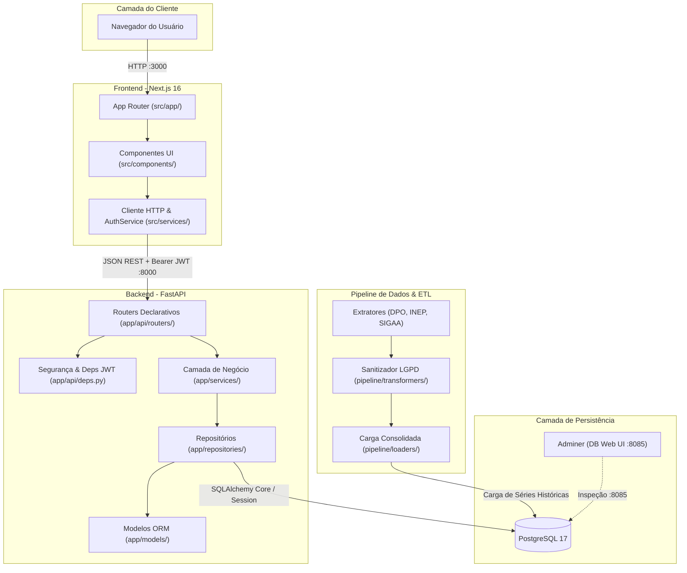
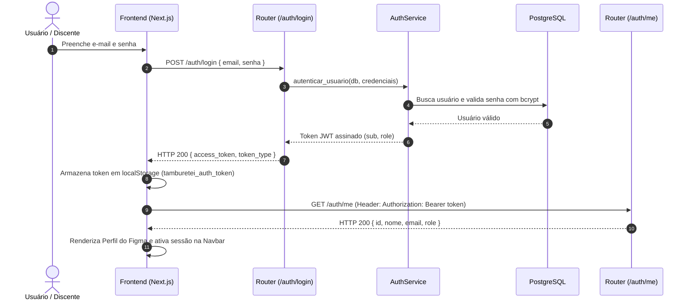

# 🏗️ Arquitetura Geral do Sistema — Tamburetei UnB

> **Documento Oficial de Engenharia de Software e Arquitetura**  
> **Disciplina:** Métodos de Desenvolvimento de Software (MDS 2026/2) — FCTE / Universidade de Brasília (UnB)  
> **Versão:** 1.0 (Release 1)

---

## 1. Visão Geral da Arquitetura

O **Tamburetei UnB** adota uma arquitetura em camadas baseada no modelo **Cliente-Servidor desacoplado**, totalmente conteinerizado via **Docker**. A solução é dividida em quatro pilares fundamentais:

1. **Frontend (SPA / SSR)**: Desenvolvido em **Next.js 16** com **TypeScript** e **Tailwind CSS**, consumindo a API de forma assíncrona.
2. **Backend (API RESTful)**: Construído com **FastAPI** (Python 3.12), estruturado segundo os princípios da **Clean Architecture** (*Separação Estrita de Responsabilidades*).
3. **Banco de Dados (Relacional)**: **PostgreSQL 17**, gerenciado com migrações versionadas via **Alembic** e ORM **SQLAlchemy 2.0**.
4. **Pipeline de Dados (ETL & Anonimização)**: Módulos dedicados à extração, higienização ativa conforme a **LGPD** (*Privacy by Design*) e carga consolidada de indicadores acadêmicos oficiais (DPO/UnB, INEP e SIGAA).

### Diagrama Arquitetural Geral


```mermaid
flowchart TB
    subgraph ClientLayer [Camada do Cliente]
        Browser["Navegador do Usuário"]
    end

    subgraph FrontendApp [Frontend - Next.js 16]
        Pages["App Router (src/app/)"]
        Components["Componentes UI (src/components/)"]
        Services["Cliente HTTP & AuthService (src/services/)"]
        Pages --> Components
        Components --> Services
    end

    subgraph BackendAPI [Backend - FastAPI]
        Router["Routers Declarativos (app/api/routers/)"]
        AuthJWT["Segurança & Deps JWT (app/api/deps.py)"]
        ServiceLayer["Camada de Negócio (app/services/)"]
        RepoLayer["Repositórios (app/repositories/)"]
        Models["Modelos ORM (app/models/)"]
        
        Router --> AuthJWT
        Router --> ServiceLayer
        ServiceLayer --> RepoLayer
        RepoLayer --> Models
    end

    subgraph DataStorage [Camada de Persistência]
        Postgres[("PostgreSQL 17")]
        Adminer["Adminer (DB Web UI :8085)"]
    end

    subgraph PipelineLayer [Pipeline de Dados & ETL]
        Extractors["Extratores (DPO, INEP, SIGAA)"]
        Sanitizer["Sanitizador LGPD (pipeline/transformers/)"]
        Loader["Carga Consolidada (pipeline/loaders/)"]
        Extractors --> Sanitizer --> Loader
    end

    Browser -->|HTTP :3000| Pages
    Services -->|JSON REST + Bearer JWT :8000| Router
    RepoLayer -->|SQLAlchemy Core / Session| Postgres
    Loader -->|Carga de Séries Históricas| Postgres
    Adminer -.->|Inspeção :8085| Postgres
```

---

## 2. Tecnologias Utilizadas (Tech Stack)

A seleção tecnológica priorizou robustez, desempenho assíncrono, tipagem estática e produtividade no desenvolvimento:

### 🌐 Frontend
| Tecnologia | Versão | Propósito no Projeto |
| :--- | :--- | :--- |
| **Next.js** | 16.x | Framework React com App Router, renderização híbrida e rotas otimizadas |
| **React** | 19.x | Biblioteca de interfaces reativas baseadas em componentes |
| **TypeScript** | 5.x | Tipagem estática rigorosa para garantir consistência dos contratos de dados |
| **Tailwind CSS** | 4.x | Estilização utilitária de alto desempenho aderente ao Design System do Figma |
| **Fetch API / HttpClient** | Nativo | Cliente HTTP desacoplado com tratamento de erros de rede e injeção de tokens |

### ⚙️ Backend
| Tecnologia | Versão | Propósito no Projeto |
| :--- | :--- | :--- |
| **Python** | 3.12 | Linguagem principal do ecossistema de dados e backend |
| **FastAPI** | 0.115+ | Framework web assíncrono moderno com documentação OpenAPI/Swagger nativa |
| **SQLAlchemy** | 2.0+ | ORM de alta performance para mapeamento objeto-relacional com `selectinload` |
| **Pydantic** | 2.x | Validação robusta de schemas, tipagem e mensagens de erro em português |
| **Alembic** | 1.14+ | Controle e versionamento declarativo das migrações do banco de dados |
| **Python-Jose / Passlib** | 3.x / 1.7+ | Criptografia de senhas (bcrypt) e emissão de tokens JWT assinados |
| **Pytest** | 9.x | Framework de testes unitários e de integração com fixture isolation |

### 🗄️ Dados e Infraestrutura
| Tecnologia | Versão | Propósito no Projeto |
| :--- | :--- | :--- |
| **PostgreSQL** | 17 | Sistema de gerenciamento de banco de dados relacional de missão crítica |
| **Adminer** | Latest | Interface gráfica web leve para gerenciamento e depuração do banco local |
| **Docker & Docker Compose** | 3.8+ | Isolamento de containers e padronização do ambiente local e de produção |
| **MkDocs & ReadTheDocs** | Latest | Geração da documentação técnica e arquitetural estática via GitHub Pages |

---

## 3. Padrões de Projeto e Camadas de Software

O backend adota o padrão **Clean Architecture**, onde cada camada possui um contrato claro e inviolável:

```
[Requisição HTTP] 
        ↓
1. Routers Declarativos (app/api/routers/)
        ↓ (Validação com Pydantic Schemas)
2. Serviços de Negócio (app/services/)
        ↓ (Entidades de Domínio e Regras)
3. Repositórios (app/repositories/)
        ↓ (Consultas SQLAlchemy otimizadas)
4. Banco de Dados (PostgreSQL 17)
```

1. **Routers (`app/api/routers/`)**:
   - Exclusivamente declarativos. Não contêm queries SQL (`db.query`) nem regras de negócio.
   - Responsáveis por definir parâmetros de rota, status codes HTTP e injeção de dependências (`get_db`, `get_current_user`).
2. **Schemas (`app/api/schemas/`)**:
   - Modelos Pydantic v2 que validam entradas e formatam saídas da API.
   - Validações personalizadas com `PydanticCustomError` emitindo mensagens humanizadas em português.
3. **Services (`app/services/`)**:
   - Centralizam os casos de uso, regras de validação de duplicidade, cálculos analíticos (concorrência, taxas de ocupação) e coordenação de transações.
4. **Repositories (`app/repositories/`)**:
   - Isolam a manipulação do banco de dados utilizando métodos como `get_by_id`, `listar`, `create`.
   - Utilizam carregamento antecipado (`selectinload`) para evitar consultas redundantes do tipo N+1.
5. **Models (`app/models/`)**:
   - Mapeamento das tabelas relacionais do PostgreSQL usando SQLAlchemy Declarative Base.

---

## 4. Estrutura de Pastas do Repositório

Abaixo está o mapa completo e detalhado da estrutura do projeto:

```text
2026-02-TambureteiUnB/
├── .github/                   # Configurações do GitHub (workflows de CI/CD, PR template)
│   ├── pull_request_template.md
│   └── workflows/
├── docs/                      # Documentação oficial do projeto servida com MkDocs
│   ├── index.md               # Documento de Visão do Produto
│   ├── arquitetura.md         # Arquitetura geral, tecnologias e estrutura (este documento)
│   ├── requisitos.md          # Requisitos funcionais (RF) e não funcionais (RNF)
│   ├── historias_usuario_*.md # Épicos e Histórias de Usuário (Backend, Frontend, DB)
│   ├── pipeline_etl.md        # Especificação da pipeline de ingestão e sanitização LGPD
│   ├── popular_banco_de_dados.md # Guia prático de carga inicial do banco
│   └── desenvolvimento.md     # Guia de contribuição e boas práticas
├── specs/                     # Especificações arquiteturais formais da equipe
│   └── backend-architecture-spec.md
├── backend/                   # Código-fonte da API Backend (FastAPI + SQLAlchemy)
│   ├── Dockerfile             # Configuração da imagem Docker do backend
│   ├── requirements.txt       # Dependências Python gerenciadas
│   ├── alembic.ini            # Configuração do motor de migrações
│   ├── migrations/            # Scripts versionados de migração do banco
│   ├── app/
│   │   ├── main.py            # Ponto de entrada da aplicação FastAPI e middlewares CORS
│   │   ├── api/
│   │   │   ├── deps.py        # Dependências injetáveis (DB session, auth JWT, RBAC)
│   │   │   ├── routers/       # Endpoints HTTP (auth, cursos, disciplinas, turmas, etc.)
│   │   │   └── schemas/       # Schemas Pydantic v2 de entrada e saída
│   │   ├── core/              # Configurações gerais (.env), segurança e banco
│   │   ├── models/            # Entidades do banco de dados (SQLAlchemy Models)
│   │   ├── repositories/      # Camada de acesso a dados (Repository Pattern)
│   │   ├── services/          # Camada de casos de uso e regras de negócio
│   │   └── pipeline/          # Módulos do pipeline ETL (extratores, sanitizador LGPD, loaders)
│   └── tests/                 # Suíte de testes automatizados com Pytest
│       ├── conftest.py        # Fixtures de sessão de teste e cliente HTTP isolado
│       ├── unit/              # Testes unitários de schemas e pipeline
│       └── integration/       # Testes de integração de endpoints e autenticação
├── frontend/                  # Aplicação Web (Next.js 16 + React 19 + TypeScript)
│   ├── package.json           # Dependências e scripts de execução (npm run dev, build)
│   ├── tsconfig.json          # Configurações do compilador TypeScript
│   ├── src/
│   │   ├── app/               # Rotas e páginas do Next.js App Router
│   │   │   ├── page.tsx       # Página inicial (Hero, indicadores e destaques)
│   │   │   ├── login/         # Tela de autenticação discente
│   │   │   ├── cadastro/      # Tela de criação de conta
│   │   │   ├── cursos/        # Catálogo geral de cursos e página interna [slug]
│   │   │   └── disciplinas/   # Catálogo e detalhamento de disciplinas [slug]
│   │   ├── components/        # Componentes reutilizáveis (Navbar, Button, Input, etc.)
│   │   ├── services/          # Integração HTTP centralizada (httpClient, authService)
│   │   └── types/             # Definições de tipos TypeScript do domínio
│   └── figma-export/          # Exportação de referência visual e Design System do Figma
├── .env.example               # Modelo de variáveis de ambiente para backend e banco
├── docker-compose.yml         # Orquestração local dos containers (db, backend, adminer)
├── init.sql                   # Esquema DDL inicial e views analíticas do PostgreSQL
├── mkdocs.yml                 # Configuração do portal de documentação MkDocs
└── README.md                  # Apresentação do projeto e guia passo a passo de execução
```

---

## 5. Fluxo de Autenticação e Segurança

O sistema opera com autenticação baseada em **JSON Web Tokens (JWT)**:


```mermaid
sequenceDiagram
    autonumber
    actor Aluno as Usuário / Discente
    participant Front as Frontend (Next.js)
    participant AuthRouter as Router (/auth/login)
    participant AuthService as AuthService
    participant DB as PostgreSQL
    participant MeRouter as Router (/auth/me)

    Aluno->>Front: Preenche e-mail e senha
    Front->>AuthRouter: POST /auth/login { email, senha }
    AuthRouter->>AuthService: autenticar_usuario(db, credenciais)
    AuthService->>DB: Busca usuário e valida senha com bcrypt
    DB-->>AuthService: Usuário válido
    AuthService-->>AuthRouter: Token JWT assinado (sub, role)
    AuthRouter-->>Front: HTTP 200 { access_token, token_type }
    Front->>Front: Armazena token em localStorage (tamburetei_auth_token)
    Front->>MeRouter: GET /auth/me (Header: Authorization: Bearer token)
    MeRouter-->>Front: HTTP 200 { id, nome, email, role }
    Front->>Front: Renderiza Perfil do Figma e ativa sessão na Navbar
```

### Princípios de Segurança e Privacidade Adotados:
* **Privacidade por Padrão (*Privacy by Design*)**: Nenhum dado sensível de estudantes (CPF, matrícula, histórico pessoal nominal) é coletado, armazenado ou exibido na plataforma.
* **Criptografia Forte**: Senhas são armazenadas utilizando salt e hash criptográfico **bcrypt**.
* **Stateless**: O backend valida o token JWT de forma independente em cada requisição sem necessidade de armazenar sessões em memória do servidor.
