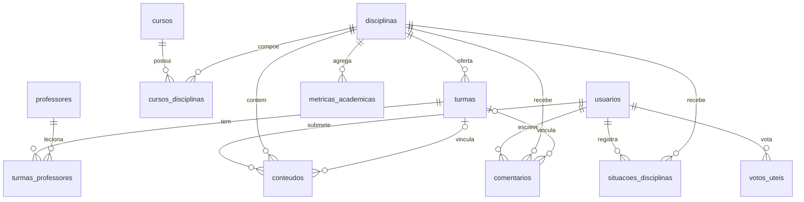

# Dicionário de Dados — Modelo Relacional

Este documento descreve o modelo relacional ativo do **Tamburetei UnB** (PostgreSQL 17), conforme criado pelo script `init.sql`. O esquema possui **12 tabelas de domínio** e a tabela de controle `alembic_version`.

## Diagrama Entidade-Relacionamento

---

## 1. Usuários e Segurança

### `usuarios`
Contas de acesso à plataforma. Seguindo o *Privacy by Design*, **não armazena matrícula, CPF ou histórico acadêmico**.

| Coluna | Tipo | Restrições | Descrição |
|---|---|---|---|
| `id` | UUID | **PK**, default `gen_random_uuid()` | Identificador não sequencial (evita enumeração) |
| `nome` | VARCHAR(100) | NOT NULL | Nome de exibição |
| `email` | VARCHAR(150) | NOT NULL, UNIQUE | Login do usuário |
| `password_hash` | VARCHAR(255) | NOT NULL | Hash bcrypt da senha |
| `role` | VARCHAR(20) | NOT NULL, default `'STUDENT'`, CHECK (`STUDENT`, `MODERATOR`, `ADMIN`) | Perfil de permissão |
| `is_active` | BOOLEAN | NOT NULL, default `TRUE` | Desativação lógica da conta (LGPD) |
| `created_at` | TIMESTAMPTZ | NOT NULL, default `NOW()` | Data de criação |

---

## 2. Estrutura Acadêmica

### `cursos`
Metadados institucionais dos cursos de graduação.

| Coluna | Tipo | Restrições | Descrição |
|---|---|---|---|
| `id` | SERIAL | **PK** | Identificador |
| `codigo_mec` | VARCHAR(20) | UNIQUE | Código do curso no MEC |
| `nome` | VARCHAR(150) | NOT NULL | Nome do curso |
| `campus` | VARCHAR(100) | NOT NULL, default `'FCTE - Gama'` | Campus de oferta |
| `grau` | VARCHAR(50) | default `'Bacharelado'` | Grau acadêmico |
| `turno` | VARCHAR(50) | default `'Diurno'` | Turno |
| `slug` | VARCHAR(150) | NOT NULL, UNIQUE | Identificador amigável para URLs |
| `created_at` | TIMESTAMPTZ | NOT NULL, default `NOW()` | Data de criação |

### `disciplinas`
Cadastro canônico das disciplinas.

| Coluna | Tipo | Restrições | Descrição |
|---|---|---|---|
| `id` | SERIAL | **PK** | Identificador |
| `codigo` | VARCHAR(30) | NOT NULL | Código acadêmico (ex.: `FGA0001`) |
| `slug` | VARCHAR(150) | NOT NULL, UNIQUE | Usado na rota `/cadeiras/:slug` |
| `nome` | VARCHAR(150) | NOT NULL | Nome da disciplina |
| `departamento` | VARCHAR(100) | — | Departamento responsável (texto livre, sem FK) |
| `creditos` | INT | CHECK (> 0) | Quantidade de créditos |
| `carga_horaria` | INT | CHECK (> 0) | Carga horária total |
| `ementa` | TEXT | — | Ementa da disciplina |
| `created_at` | TIMESTAMPTZ | NOT NULL, default `NOW()` | Data de criação |

### `cursos_disciplinas`
Tabela associativa **N:N** que representa a matriz curricular de cada curso.

| Coluna | Tipo | Restrições | Descrição |
|---|---|---|---|
| `id` | SERIAL | **PK** | Identificador |
| `curso_id` | INT | NOT NULL, **FK** → `cursos(id)` ON DELETE CASCADE | Curso |
| `disciplina_id` | INT | NOT NULL, **FK** → `disciplinas(id)` ON DELETE CASCADE | Disciplina |
| `periodo_sugerido` | INT | CHECK (> 0) | Semestre sugerido (NULL para optativas livres) |
| `is_obrigatoria` | BOOLEAN | NOT NULL, default `TRUE` | Obrigatória ou optativa |
| `created_at` | TIMESTAMPTZ | NOT NULL, default `NOW()` | Data de criação |

**Restrição:** `UNIQUE (curso_id, disciplina_id)` impede vínculo duplicado.

---

## 3. Corpo Docente e Turmas

### `professores`
Cadastro dos docentes.

| Coluna | Tipo | Restrições | Descrição |
|---|---|---|---|
| `id` | SERIAL | **PK** | Identificador |
| `nome` | VARCHAR(150) | NOT NULL | Nome do docente |
| `departamento` | VARCHAR(100) | — | Departamento (texto livre, sem FK) |
| `created_at` | TIMESTAMPTZ | NOT NULL, default `NOW()` | Data de criação |

### `turmas`
Oferta concreta de uma disciplina em um semestre (ex.: Turma 01 manhã × Turma 02 tarde).

| Coluna | Tipo | Restrições | Descrição |
|---|---|---|---|
| `id` | SERIAL | **PK** | Identificador |
| `disciplina_id` | INT | NOT NULL, **FK** → `disciplinas(id)` ON DELETE CASCADE | Disciplina ofertada |
| `codigo_turma` | VARCHAR(10) | NOT NULL | Código da turma (ex.: `01`, `A`) |
| `semestre` | VARCHAR(10) | NOT NULL | Semestre letivo (ex.: `2026.1`) |
| `horario` | VARCHAR(255) | — | Código de horário SIGAA (ex.: `35M12`) |
| `local` | VARCHAR(255) | — | Sala ou prédio |
| `created_at` | TIMESTAMPTZ | NOT NULL, default `NOW()` | Data de criação |

**Restrição:** `UNIQUE (disciplina_id, codigo_turma, semestre)`.

### `turmas_professores`
Tabela associativa **N:N** entre turmas e professores (suporta co-docência).

| Coluna | Tipo | Restrições | Descrição |
|---|---|---|---|
| `turma_id` | INT | **PK composta**, **FK** → `turmas(id)` ON DELETE CASCADE | Turma |
| `professor_id` | INT | **PK composta**, **FK** → `professores(id)` ON DELETE CASCADE | Professor |

---

## 4. Métricas Acadêmicas Históricas

### `metricas_academicas`
Fato analítico **agregado** com dados públicos (DPO/INEP/LAI). Não contém dados individuais de estudantes.

| Coluna | Tipo | Restrições | Descrição |
|---|---|---|---|
| `id` | BIGSERIAL | **PK** | Identificador |
| `disciplina_id` | INT | NOT NULL, **FK** → `disciplinas(id)` ON DELETE CASCADE | Disciplina |
| `ano` | INT | NOT NULL | Ano letivo |
| `semestre` | INT | NOT NULL, CHECK (1, 2) | Semestre |
| `matriculados` | INT | NOT NULL, default 0 | Total de matriculados |
| `aprovados` | INT | NOT NULL, default 0 | Total de aprovados |
| `reprovados_nota` | INT | NOT NULL, default 0 | Reprovações por nota |
| `reprovados_falta` | INT | NOT NULL, default 0 | Reprovações por falta |
| `trancamentos` | INT | NOT NULL, default 0 | Trancamentos |
| `taxa_aprovacao` | NUMERIC(5,2) | — | Percentual de aprovação (ex.: `78.50`) |
| `created_at` | TIMESTAMPTZ | NOT NULL, default `NOW()` | Data de criação |

**Restrição:** `UNIQUE (disciplina_id, ano, semestre)`.

---

## 5. Colaboração Discente

### `situacoes_disciplinas`
Crowdsourcing "Já cursei essa matéria". Alimenta apenas estatísticas agregadas.

| Coluna | Tipo | Restrições | Descrição |
|---|---|---|---|
| `id` | BIGSERIAL | **PK** | Identificador |
| `usuario_id` | UUID | NOT NULL, **FK** → `usuarios(id)` ON DELETE CASCADE | Estudante |
| `disciplina_id` | INT | NOT NULL, **FK** → `disciplinas(id)` ON DELETE CASCADE | Disciplina |
| `situacao` | VARCHAR(20) | NOT NULL, CHECK (`APROVADO`, `REPROVADO_NOTA`, `REPROVADO_FALTA`, `TRANCOU`) | Resultado declarado |
| `updated_at` | TIMESTAMPTZ | NOT NULL, default `NOW()` | Data de criação |

**Restrição:** `UNIQUE (usuario_id, disciplina_id)`, ou seja, um registro por aluno e disciplina (RN02).

### `conteudos`
Materiais de apoio: resumos, links, provas antigas e dicas.

| Coluna | Tipo | Restrições | Descrição |
|---|---|---|---|
| `id` | BIGSERIAL | **PK** | Identificador |
| `disciplina_id` | INT | NOT NULL, **FK** → `disciplinas(id)` ON DELETE CASCADE | Disciplina |
| `turma_id` | INT | **FK** → `turmas(id)` ON DELETE SET NULL | Turma (opcional) |
| `usuario_id` | UUID | **FK** → `usuarios(id)` ON DELETE SET NULL | Autor (mantido se a conta for removida) |
| `titulo` | VARCHAR(200) | NOT NULL | Título |
| `descricao` | TEXT | — | Descrição |
| `tipo` | VARCHAR(30) | NOT NULL, CHECK (`LINK_UTIL`, `RESUMO`, `PROVA_ANTIGA`, `DICA`) | Tipo de material |
| `url_origem` | TEXT | NOT NULL | Link do material |
| `semestre` | VARCHAR(10) | — | Semestre de referência |
| `status_curadoria` | VARCHAR(20) | NOT NULL, default `'PENDENTE'`, CHECK (`PENDENTE`, `APROVADO`, `RECUSADO`) | Moderação (RN06) |
| `created_at` | TIMESTAMPTZ | NOT NULL, default `NOW()` | Data de criação |
| `updated_at` | TIMESTAMPTZ | NOT NULL, default `NOW()` | Data de atualização |

### `comentarios`
Relatos e discussões, exibidos sob pseudônimo.

| Coluna | Tipo | Restrições | Descrição |
|---|---|---|---|
| `id` | BIGSERIAL | **PK** | Identificador |
| `disciplina_id` | INT | NOT NULL, **FK** → `disciplinas(id)` ON DELETE CASCADE | Disciplina |
| `turma_id` | INT | **FK** → `turmas(id)` ON DELETE SET NULL | Turma (opcional) |
| `usuario_id` | UUID | NOT NULL, **FK** → `usuarios(id)` ON DELETE CASCADE | Autor real (não exibido) |
| `autor_alias` | VARCHAR(50) | NOT NULL, default `'Estudante Anônimo'` | Pseudônimo público (RN01) |
| `topico_dificuldade` | VARCHAR(150) | — | Tópico abordado |
| `conteudo` | TEXT | NOT NULL | Texto do comentário |
| `parent_id` | BIGINT | **FK** → `comentarios(id)` ON DELETE CASCADE | Comentário pai (respostas em thread) |
| `status_moderacao` | VARCHAR(20) | NOT NULL, default `'PUBLICADO'`, CHECK (`PUBLICADO`, `PENDENTE`, `OCULTO`) | Moderação |
| `created_at` | TIMESTAMPTZ | NOT NULL, default `NOW()` | Data de criação |

### `votos_uteis`
Upvotes de relevância em conteúdos e comentários.

| Coluna | Tipo | Restrições | Descrição |
|---|---|---|---|
| `id` | BIGSERIAL | **PK** | Identificador |
| `usuario_id` | UUID | NOT NULL, **FK** → `usuarios(id)` ON DELETE CASCADE | Quem votou |
| `target_type` | VARCHAR(20) | NOT NULL, CHECK (`CONTEUDO`, `COMENTARIO`) | Tipo do alvo |
| `target_id` | BIGINT | NOT NULL | ID do alvo (associação polimórfica, sem FK física) |
| `created_at` | TIMESTAMPTZ | NOT NULL, default `NOW()` | Data do voto |

**Restrição:** `UNIQUE (usuario_id, target_type, target_id)`, ou seja, um voto por item (RN03).

---

## 6. Controle de Migrações

### `alembic_version`
Tabela interna do Alembic que registra a revisão aplicada ao banco.

| Coluna | Tipo | Restrições | Descrição |
|---|---|---|---|
| `version_num` | VARCHAR(32) | **PK** | Revisão atual (o `init.sql` grava `'001'`) |

---

## ⚠️ Débitos Técnicos

### DT-01 — Inconsistência de baseline entre `init.sql` e Alembic

**Diagnóstico:**
O `init.sql` cria o esquema e grava `alembic_version = '001'`. Porém, o diretório `backend/alembic/versions/` já possui migrações até a **`007`**:

| Revisão | Migração |
|---|---|
| 001 | `initial_schema` |
| 002 | `add_amostragem_suprimida_lgpd` |
| 003 | `add_turma_ocupacao_and_metricas_consolidadas` |
| 004 | `widen_turma_horario_and_local` |
| 005 | `widen_departamento_columns` |
| 006 | `add_requisitos_and_natureza` |
| 007 | `add_metricas_cursos` |

As alterações das revisões 002 a 007 não estão refletidas no `init.sql`. Exemplos: a coluna `amostragem_suprimida_lgpd` em `metricas_academicas` e o aumento de `departamento` para 255 caracteres. Assim, um banco criado só pelo `init.sql` fica divergente dos models SQLAlchemy.

**Situação atual:**
O container sobe normalmente graças à tolerância configurada no `entrypoint.sh`. Por decisão da Sprint, o `init.sql` e as migrações **não foram alterados**, para preservar a estabilidade.

**Recomendação (Sprint futura dedicada a banco):**
1. Definir o Alembic como **fonte única da verdade** do esquema (RNF05 — Database-as-Code).
2. Reduzir o `init.sql` a tarefas que o Alembic não cobre (ex.: `CREATE EXTENSION pgcrypto`) e mover os dados de exemplo para um script de *seed* separado.
3. Realizar o saneamento de forma **idempotente**: validar em um banco limpo que `alembic upgrade head` gera exatamente o esquema dos models e, para bancos já existentes, alinhar a revisão com `alembic stamp`.
4. Adicionar um teste no CI que suba um banco vazio e execute as migrações, impedindo nova divergência.