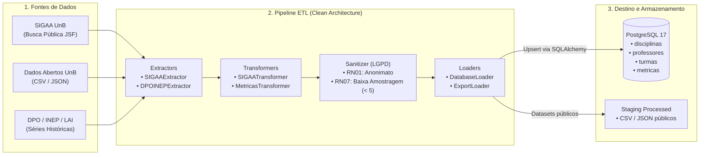

# 🔄 Pipeline de Dados e Ingestão ETL (SIGAA e Dados Abertos)

Este documento descreve a especificação técnica, a arquitetura em camadas, as políticas de conformidade com a LGPD e os procedimentos operacionais do **Pipeline de Dados e ETL** do **Tamburetei UnB**, atendendo aos entregáveis técnicos da **Release 1 (R1)** da disciplina Métodos de Desenvolvimento de Software (MDS 2026/2 — FCTE/UnB).

---

## 1. Visão Geral e Propósito

O pipeline de dados é o componente de engenharia de dados responsável por automatizar o ciclo de vida dos dados acadêmicos públicos da Universidade de Brasília (UnB), compreendendo:

1. **Ingestão de Turmas e Catálogo Curricular:** Extração de ofertas de turmas, componentes curriculares, docentes e horários a partir do SIGAA e do Portal de Dados Abertos da UnB.
2. **Ingestão de Séries Históricas:** Coleta de indicadores de aprovação, reprovação por nota/falta e trancamentos disponibilizados pelo Decanato de Planejamento, Orçamento e Avaliação Institucional (DPO), INEP e LAI.
3. **Higienização e Governança:** Limpeza de strings, normalização para *Title Case*, geração canônica de *slugs* para URLs amigáveis (`/cadeiras/:slug`) e garantia de conformidade com a LGPD (*Privacy by Design*).
4. **Carga Idempotente e Exportação:** Ingestão estruturada no banco relacional PostgreSQL 17 via SQLAlchemy 2.0 e exportação de datasets limpos em CSV e JSON ([RF06]).



---

## 2. Arquitetura Modular em Camadas

O módulo reside em [`backend/app/pipeline/`](file:///c:/Users/Wagne/OneDrive/Desktop/Projetos/G9-2026-2/backend/app/pipeline/) e é decomposto em quatro responsabilidades estritas:

```
backend/app/pipeline/
├── extractors/            # Camada de Extração
│   ├── base.py            # Classe abstrata BaseExtractor
│   ├── sigaa_extractor.py # Extrator JSF do SIGAA e leitor de CSV/JSON
│   └── dpo_inep_extractor.py # Extrator de relatórios históricos DPO/INEP
│
├── transformers/          # Camada de Transformação e Higienização
│   ├── base.py            # Classe abstrata BaseTransformer
│   ├── sigaa_transformer.py # Title case de docentes, deduplicação e slugs
│   ├── metricas_transformer.py # Validação de consistência e cálculo de taxas
│   └── sanitizer.py       # Sanitizador LGPD (Regras RN01 e RN07)
│
├── loaders/               # Camada de Carga e Persistência
│   ├── base.py            # Classe abstrata BaseLoader
│   ├── db_loader.py       # Ingestão relacional com upsert idempotente no PostgreSQL
│   └── export_loader.py   # Exportação em lote para arquivos CSV e JSON (RF06)
│
├── schemas/               # Contratos e Validação de Dados (Pydantic v2)
│   ├── sigaa.py           # Schemas brutos e normalizados de turmas, matérias e docentes
│   └── metricas.py        # Schemas de indicadores analíticos agregados
│
├── data/                  # Diretório de Staging de Dados
│   ├── raw/               # Arquivos brutos baixados (ignorado no Git)
│   ├── processed/         # Datasets higienizados gerados pelo ExportLoader
│   ├── departamentos_ID_unb.csv # Mapeamento dos 211 departamentos da UnB
│   └── sample_turmas.csv  # Amostra canônica para testes automatizados
│
├── config.py              # Parâmetros de execução, URLs e limites LGPD
├── runner.py              # Orquestrador unificado do pipeline (ETLRunner)
└── cli.py                 # Interface CLI para terminal e contêiner Docker
```

---

## 3. Particularidades Técnicas do SIGAA e Soluções Implementadas

O portal público do SIGAA da UnB utiliza a tecnologia legada **JavaServer Faces (JSF)**, que impõe desafios técnicos contornados no `SIGAAExtractor`:

| Desafio no SIGAA | Causa Raiz | Solução Implementada no Extrator |
| :--- | :--- | :--- |
| **Busca obrigatória por Unidade** | O formulário não permite selecionar "todas as turmas" de uma vez. | Utilização da lista [`departamentos_ID_unb.csv`](file:///c:/Users/Wagne/OneDrive/Desktop/Projetos/G9-2026-2/backend/app/pipeline/data/departamentos_ID_unb.csv) para consultar sequencialmente os 211 departamentos da UnB. |
| **Sessão JSF e ViewState expirados** | Requisições POST diretas sem cookie inicial falham com `ViewExpiredException`. | Abertura de sessão com requisição prévia à home (`/public/home.jsf`) e extração dinâmica do token `javax.faces.ViewState`. |
| **Nome dinâmico do botão de busca** | O atributo `name` do botão "Buscar" varia a cada build do SIGAA. | Inspeção do DOM via BeautifulSoup para localizar dinamicamente o `name` do elemento com `value="Buscar"`. |
| **Co-docência e Carga Horária** | Docentes são listados com carga horária agregada (ex: `PROF A (60h)`). | Expressão regular que extrai e separa múltiplos professores e remove a notação de carga horária para popular a tabela N:N `turmas_professores`. |

---

## 4. Governança e Conformidade com a LGPD (*Privacy by Design*)

O pipeline segue estritamente as regras de privacidade discente estabelecidas para o projeto:

* **[RN01 / RNF02] Anonimato Discente:** O [`LGPDSanitizer`](file:///c:/Users/Wagne/OneDrive/Desktop/Projetos/G9-2026-2/backend/app/pipeline/transformers/sanitizer.py) atua como um filtro ativo que elimina qualquer identificador pessoal direto ou indireto (matrícula, CPF, e-mail institucional, nomes de alunos ou IRA) antes de qualquer persistência.
* **[RN07] Política de Baixa Amostragem:** Turmas ou métricas históricas com menos de **5 alunos matriculados** têm seus microdados individuais suprimidos (`amostragem_suprimida_lgpd = True`), anulando contadores parciais de reprovação para impedir a reidentificação discente por inferência estatística.

---

## 5. Como Executar e Operar o Pipeline

### Execução via Contêiner Docker (Padrão Oficial)

Com os contêineres em execução (`docker compose up -d`):

1. **Executar testes automatizados com cobertura:**
   ```bash
   docker compose exec backend pytest tests/test_pipeline.py -v
   ```

2. **Processar dados em modo simulação (Dry-Run — sem alterar o banco):**
   ```bash
   docker compose exec backend python -m app.pipeline.cli --source sigaa --input-file app/pipeline/data/sample_turmas.csv --dry-run
   ```

3. **Carga real de dados no PostgreSQL 17:**
   ```bash
   docker compose exec backend python -m app.pipeline.cli --source sigaa --input-file app/pipeline/data/sample_turmas.csv
   ```

4. **Processar o dataset de 6.133 turmas da UnB de 2026.1:**
   ```bash
   docker compose exec backend python -m app.pipeline.cli --source sigaa --input-file app/pipeline/data/raw/turmas_unb_20260226_FULL.csv --dry-run
   ```

5. **Scraping online ao vivo do SIGAA:**
   ```bash
   docker compose exec backend python -m app.pipeline.cli --source sigaa --semestre 2026.1 --dry-run
   ```

---

## 6. Rastreabilidade com os Requisitos do Projeto

| Requisito / Critério | Componente Responsável | Status |
| :--- | :--- | :--- |
| **R1 — Pipeline ETL Docker** | `backend/app/pipeline/` e `docker-compose.yml` | Implementado e Validado |
| **RN01 / RNF02 — LGPD Privacy by Design** | `LGPDSanitizer` | Implementado e Validado (100% testes) |
| **RN07 — Baixa Amostragem (< 5 alunos)** | `LGPDSanitizer.sanitize_metricas()` | Implementado e Validado |
| **RF06 — Exportação de Dados Abertos** | `ExportLoader` (JSON e CSV) | Implementado e Validado |
| **US 2.1.1 — Turmas e Professores N:N** | `DatabaseLoader` e modelos relacionais | Implementado e Validado |
