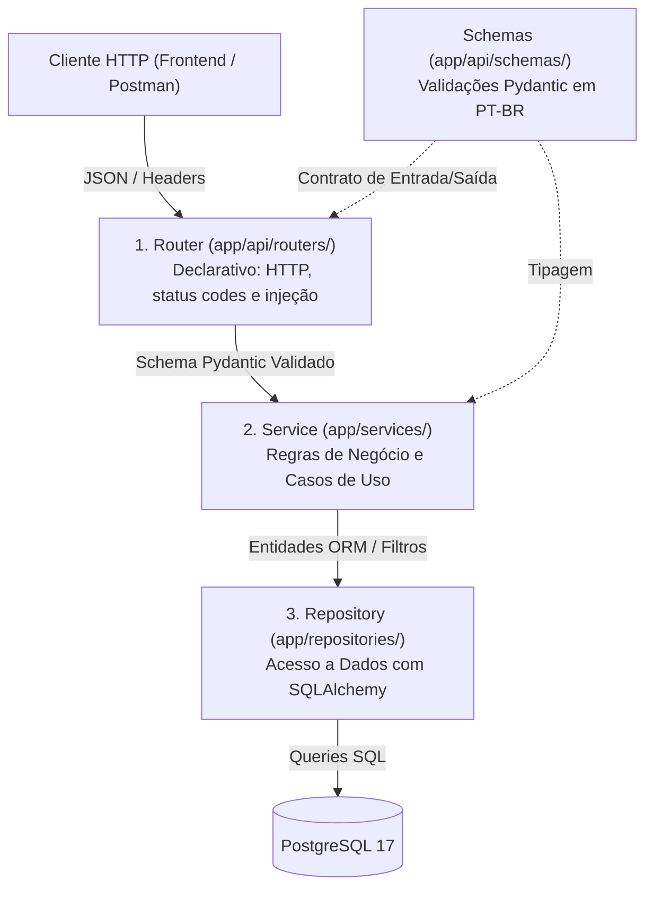

# 📐 Especificação Arquitetural do Backend — Tamburetei UnB

> **Status:** Ativo / Obrigatório  
> **Disciplina:** Métodos de Desenvolvimento de Software (MDS) — FCTE/UnB (2026/2)  
> **Alvo:** Todo código em `backend/app/`

---

## 1. Visão Geral e Princípios

O backend do **Tamburetei UnB** segue rigorosamente os princípios de **Clean Architecture** e **Separação Estrita de Responsabilidades** (*Separation of Concerns*). 

Cada camada do sistema possui uma responsabilidade única e bem definida. Nenhuma camada pode pular intermediários ou assumir atribuições de outra camada.



---

## 2. Especificação Detalhada por Camada

### 🚪 Camada 1: Routers (`app/api/routers/`)
**Responsabilidade Única:** Interface com o protocolo HTTP.
- Definir rotas, métodos (`GET`, `POST`, etc.), tags do Swagger e status codes.
- Injetar dependências (`db: Session = Depends(get_db)`, `current_user = Depends(...)`).
- Receber os dados validados pelo Pydantic e **delegar imediatamente** para a camada de serviço.
- Retornar o modelo de resposta (`response_model`).

#### 🛑 O que é ESTRITAMENTE PROIBIDO no Router:
1. **Fazer queries no banco:** Nunca use `db.query(...)` ou chame repositórios diretamente no router.
2. **Lógica de negócio:** Nunca faça verificações de existência (ex.: `if not disciplina: raise 404`), checagem de duplicidade ou cálculo de paginação (`math.ceil`) dentro do router.
3. **Instanciar Models do ORM:** O router nunca deve instanciar classes como `Turma(...)` ou `Usuario(...)`.

#### ✅ Exemplo de Router Correto:
```python
# app/api/routers/turmas.py
from fastapi import APIRouter, Depends, status
from sqlalchemy.orm import Session
from app.api.deps import require_role
from app.api.schemas.turma import TurmaCreate, TurmaResponse
from app.core.database import get_db
from app.services.turma_service import turma_service

router = APIRouter(prefix="/turmas", tags=["Turmas"])

@router.post("", response_model=TurmaResponse, status_code=status.HTTP_201_CREATED)
def criar_turma(
    dados: TurmaCreate,
    db: Session = Depends(get_db),
    _admin = Depends(require_role("ADMIN"))
):
    """Rota 100% declarativa: apenas repassa para o service."""
    return turma_service.criar_turma(db, dados)
```

---

### ⚙️ Camada 2: Services (`app/services/`)
**Responsabilidade Única:** Regras de negócio, fluxos de caso de uso e orquestração.
- Centralizar validações de domínio (ex: verificar se disciplina existe, se professores informados são válidos, se turma já existe).
- Disparar exceções HTTP (`HTTPException`) com status codes adequados (`400`, `404`, `409`).
- Orquestrar múltiplos repositórios.
- Instanciar e preencher entidades do SQLAlchemy antes da persistência.

#### ✅ Exemplo de Service Correto:
```python
# app/services/turma_service.py
from fastapi import HTTPException, status
from sqlalchemy.orm import Session
from app.api.schemas.turma import TurmaCreate
from app.models.turma import Turma
from app.repositories.disciplina_repo import disciplina_repo
from app.repositories.professor_repo import professor_repo
from app.repositories.turma_repo import turma_repo

class TurmaService:
    def criar_turma(self, db: Session, dados: TurmaCreate) -> Turma:
        # 1. Validação de Dependências
        if not disciplina_repo.get_by_id(db, dados.disciplina_id):
            raise HTTPException(status.HTTP_404_NOT_FOUND, detail="Disciplina não encontrada.")

        # 2. Conferência de Professores
        professores = professor_repo.get_by_ids(db, dados.professores_ids)
        if len(professores) != len(set(dados.professores_ids)):
            raise HTTPException(status.HTTP_404_NOT_FOUND, detail="Um ou mais professores não foram encontrados.")

        # 3. Validação de Duplicidade
        if turma_repo.get_duplicada(db, dados.disciplina_id, dados.codigo_turma, dados.semestre):
            raise HTTPException(status.HTTP_409_CONFLICT, detail="Já existe uma turma cadastrada com este código neste semestre.")

        # 4. Instanciação e Persistência
        nova_turma = Turma(
            disciplina_id=dados.disciplina_id,
            semestre=dados.semestre,
            codigo_turma=dados.codigo_turma,
            horario=dados.horario,
            local=dados.local,
            professores=professores
        )
        return turma_repo.create(db, nova_turma)

turma_service = TurmaService()
```

---

### 🗄️ Camada 3: Repositories (`app/repositories/`)
**Responsabilidade Única:** Isolamento de consultas e persistência via SQLAlchemy.
- Herdar de `BaseRepository[Model]`.
- Executar filtros, ordenações, paginação e agregações.
- **Regra Crítica para Relacionamentos N:N (Muitos-para-Muitos):**
  - Ao carregar coleções N:N (como `turmas_professores`), utilize sempre `selectinload` em vez de `joinedload`, ou aplique explicitamente `.unique()`.
  - **Motivo:** O uso incorreto de `joinedload` em coleções duplica instâncias na listagem quando houver co-docência (múltiplos professores na mesma turma).

---

### 📝 Camada 4: Schemas (`app/api/schemas/`)
**Responsabilidade Única:** Contrato de dados e validação de entrada/saída (Pydantic v2).
- Validar tipos, formatos, expressões regulares e sanitização.
- **Regra de Idioma e Humanização:**
  - Todas as mensagens de erro de validação devem ser **em português manual**, claras e amigáveis.
  - Para evitar mensagens em inglês do motor do Pydantic (`String should have at least...`), **não** utilize `min_length` solto no `Field(...)`. Faça a verificação de tamanho dentro do `@field_validator` e levante `PydanticCustomError`.

#### ✅ Exemplo de Schema com Mensagens em Português:
```python
from pydantic import BaseModel, Field, field_validator
from pydantic_core import PydanticCustomError

class TurmaCreate(BaseModel):
    disciplina_id: int = Field(..., description="ID da disciplina")
    semestre: str = Field(..., description="Semestre letivo (ex: 2026.1)")
    codigo_turma: str = Field(..., description="Código da turma (ex: 01, A)")
    professores_ids: list[int] = Field(..., description="Lista com IDs dos professores")

    @field_validator("semestre")
    @classmethod
    def validar_semestre(cls, v: str) -> str:
        import re
        v = v.strip()
        if not re.match(r"^\d{4}\.[1-4]$", v):
            raise PydanticCustomError(
                "semestre_invalido",
                "O semestre deve seguir o padrão canônico da UnB (exemplo: 2026.1 ou 2026.2)."
            )
        return v
```

---

### 🧪 Camada 5: Testes Automatizados (`backend/tests/`)
**Responsabilidade Única:** Garantia contínua de qualidade e cobertura (MDS).
- Todo novo router ou schema **deve** ser acompanhado de testes unitários com `pytest`.
- A suíte de testes deve rodar 100% verde tanto localmente quanto dentro do contêiner Docker:
  ```powershell
  docker compose exec -e TEST_DATABASE_URL="$TEST_DATABASE_URL" backend pytest -v
  ```

---

## 3. Resumo Prático: "Onde devo colocar meu código?"

| Preciso fazer... | Onde deve ficar? | O que NÃO fazer? |
| :--- | :--- | :--- |
| Criar endpoint HTTP e receber parâmetros | `app/api/routers/` | Nunca colocar SQL ou lógica aqui |
| Validar se uma entidade existe no banco | `app/services/` | Não validar no router |
| Validar formato de campo (email, tamanho, regex) | `app/api/schemas/` | Não validar no controller manual |
| Montar query SQL com filtros ou relacionamentos | `app/repositories/` | Não fazer query no service ou router |
| Declarar colunas e chaves estrangeiras | `app/models/` | Não criar tabelas sem migration do Alembic |
| Testar regras de validação ou serviços | `backend/tests/` | Não subir PR sem testes correspondentes |


## 4. Padrão operacional atual

- **Persistência:** `Session` síncrona do SQLAlchemy 2.0, driver psycopg2 e rotas `def` para operações bloqueantes. Não misturar `AsyncSession` em uma única camada sem migrar o fluxo completo.
- **Domínio:** regras puras em `app/domain/` não dependem de HTTP ou ORM. Serviços podem traduzir falhas em `HTTPException`, conforme os exemplos desta spec.
- **Transações:** consultas ficam nos repositórios. `BaseRepository.create` conclui operações simples. Materiais usam `adicionar` com flush; o serviço coordena commit/rollback e remove o arquivo quando a persistência falha. Não antecipar commit nesse repositório.
- **Utilitários comuns:** transformação textual sem regra específica do ETL fica em `core/texto.py`; serviços HTTP não devem importar o pipeline.
- **Moderação:** `conteudos` usa curadoria prévia (`PENDENTE`, `APROVADO`, `RECUSADO`). `materiais` usa o contrato das US 5.2.1–5.2.3: estado inicial `ativo`, listagem pública apenas de ativos e download para estudantes autenticados. A Feature 5.3 acrescentará as ações administrativas; não está implementada nesta entrega.
- **Configuração:** segredos vêm de ambiente ou `.env`. `SECRET_KEY` tem no mínimo 32 caracteres. Uploads são privados e ficam fora do Git e de rotas estáticas.
- **Schemas:** regras explícitas de formato e tamanho usam mensagens em português. A tradução dos erros estruturais nativos (tipo incorreto, campo ausente, limites de query) continua como melhoria pendente; não declarar tradução integral sem testes desses casos.
- **Testes:** integração exige PostgreSQL 17 exclusivo com `TEST_DATABASE_URL` e nome terminado em `_test`. Testes unitários não dependem de banco. Consulte `docs/desenvolvimento.md` para comandos. A passagem local não comprova execução Docker ou Mutmut.

A skill canônica de desenvolvimento é `skills/tamburetei-dev/SKILL.md`; outros pontos de entrada devem referenciá-la em vez de duplicar regras.
